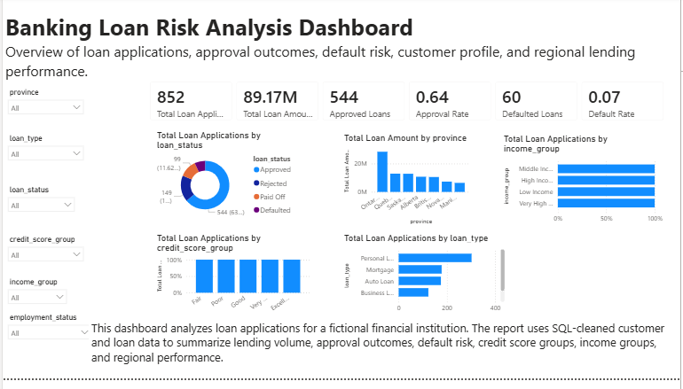
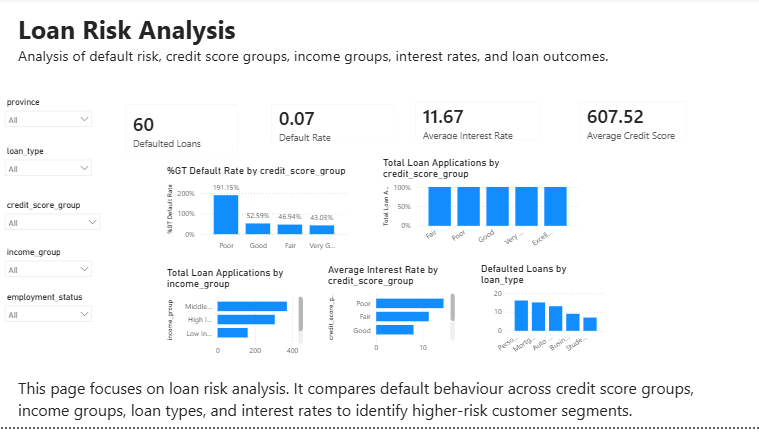

# Banking Loan Risk Analysis Using SQL and Power BI

## Project Overview

This project analyzes customer and loan data for a fictional financial institution. The purpose of the analysis is to examine loan applications, approval outcomes, default risk, customer credit profiles, and regional lending performance.

SQL was used to validate, clean, join, and transform the data. Power BI was used to create an interactive dashboard with KPI cards, slicers, and visualizations.

## Business Questions

The project focuses on the following questions:

- How many loan applications were approved, rejected, defaulted, or paid off?
- What are the overall approval and default rates?
- How do credit score and income groups relate to loan outcomes?
- Which loan types represent the highest application volume?
- Which provinces account for the highest total loan amount?
- Which customer segments demonstrate higher credit risk?

## Tools Used

- SQL
- SQLite
- Google Colab
- Power BI Desktop
- DAX
- Python and Pandas
- Excel and CSV

## Data Preparation

The data preparation process included:

- Loading five related banking datasets
- Checking duplicate records
- Identifying missing and invalid values
- Validating relationships between tables
- Joining customer, branch, account, loan, and transaction data
- Creating credit score, income, and age groups
- Creating analysis-ready SQL views
- Exporting cleaned datasets for Power BI

## Dashboard Pages

### Executive Summary

The Executive Summary provides an overview of:

- Total loan applications
- Total loan amount
- Approved and defaulted loans
- Approval rate
- Default rate
- Average credit score
- Loan status distribution
- Loan applications by type
- Regional lending performance

### Loan Risk Analysis

The Loan Risk Analysis page examines:

- Default risk by credit score group
- Loan outcomes by income group
- Interest rate patterns
- Defaulted loans by loan type
- Customer risk segments

## Key Measures

The Power BI dashboard includes DAX measures for:

- Total Loan Applications
- Total Loan Amount
- Approved Loans
- Rejected Loans
- Defaulted Loans
- Paid Off Loans
- Approval Rate
- Default Rate
- Average Loan Amount
- Average Credit Score
- Average Interest Rate

## Repository Files

- `Banking_Loan_Risk_Analysis_PowerBI.pbix` — Power BI report
- `Banking_Loan_Risk_Analysis_SQL_Google_Colab.ipynb` — SQL analysis notebook
- `data/loan_analysis_view.csv` — Loan analysis dataset
- `data/customer_risk_view.csv` — Customer risk dataset
- `images/` — Dashboard screenshots

## Note

This project uses synthetic banking data created for portfolio and educational purposes. It does not contain real customer or financial information.
